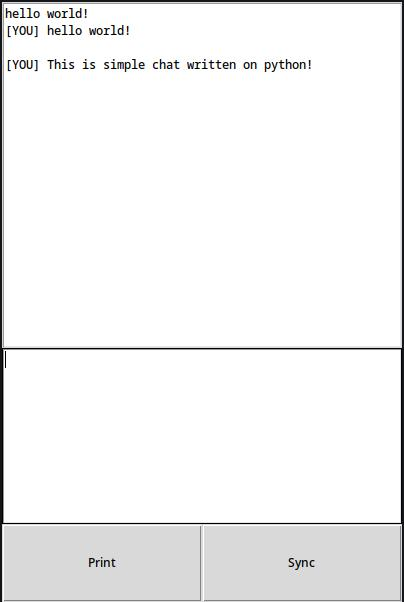

# PyChat

Pychat it is simple chat written on python, with socket lib

# How to run

1. Config and run server from `PyChat`
2. Config and run app from `tkinter`
3. Enjoy!

# Config explanation

## Server config

- `HOST` - address of server
- `PORT` - any port of server

## Client (App) config

- `HOST` - address of server that you want connect
- `PORT` - port of server that you want connect
